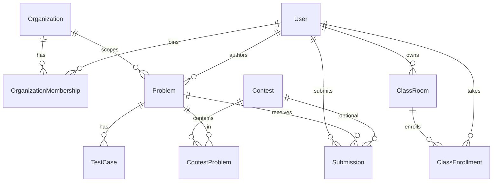

# Cơ sở dữ liệu Code Judge (`schema.prisma`)

Tài liệu mô tả **mô hình RFP**: tổ chức, lớp, contest, đề bài (visibility), AI / golden solution, submission đa ngữ cảnh, báo cáo & chống gian lận tối thiểu. **Ý nghĩa từng trường** được ghi trực tiếp trong file Prisma bằng comment `///` (khuyến nghị đọc song song); phần dưới là **tra cứu nhanh** và **DBML** cho [dbdiagram.io](https://dbdiagram.io).

---

## Kết nối & lệnh thường dùng

| Việc | Lệnh / ghi chú |
|------|----------------|
| URL DB | `DATABASE_URL` trong `prisma.config.ts` |
| Sinh client | `npm run prisma:generate -w @code-judge/core-api` |
| Migration dev | `npm run prisma:migrate -w @code-judge/core-api` (Postgres phải chạy) |
| Deploy | `npx prisma migrate deploy` |

### Migration baseline hiện tại

- Thư mục: `prisma/migrations/20260505120000_rfp_full_schema/` — SQL tạo **toàn bộ bảng trên database trống** (`migrate diff --from-empty`).
- Nếu DB cũ đã có bảng trùng tên: **reset schema dev** (`DROP SCHEMA public CASCADE; CREATE SCHEMA public;`) rồi `migrate deploy`, hoặc volume Postgres mới (`docker compose down -v` — **mất dữ liệu**).

---

## Nhóm thực thể (tư duy thiết kế)

| Nhóm | Model | Mục đích |
|------|--------|----------|
| Đa tenant | `Organization`, `OrganizationMembership` | Trường / công ty; Org Admin & phạm vi đề `ORG_INTERNAL`. |
| Người dùng | `User`, `OAuthAccount` | Tài khoản, khoá/Vô hiệu, duyệt GV, Google OAuth. |
| Lớp | `ClassRoom`, `ClassEnrollment`, `ClassInvite`, `ClassAssignment` | Mã lớp, mời email, bài tập gắn đề/contest. |
| Đề & tag | `Problem`, `ProblemTag`, `Tag`, `TestCase` | Đề, visibility, test, giới hạn số test. |
| AI (Story 5) | `GoldenSolution`, `AiGenerationJob` | Lời giải mẫu; job AI sinh test. |
| Thi | `Contest`, `ContestProblem`, `ContestParticipant` | Kỳ thi, đề trong thi, thí sinh. |
| Chấm | `Submission` | Nộp bài: `PRACTICE` / `CONTEST` / `CLASS_ASSIGNMENT`, ưu tiên queue. |
| Báo cáo & khác | `ReportExport`, `Certificate`, `CodeSimilarityFinding` | Export, chứng chỉ, gợi ý đạo mã. |

---

## dbdiagram.io — DBML (tóm tắt cấu trúc)

> `supportedLanguages` trên Postgres là `text[]`; trong DBML có thể ký hiệu `json` hoặc bỏ qua — chỉ phục vụ vẽ sơ đồ.

```dbml
Enum Role { ADMIN INSTRUCTOR STUDENT }
Enum OrgRole { ORG_ADMIN ORG_INSTRUCTOR ORG_STUDENT }
Enum InstructorVerificationStatus { NONE PENDING APPROVED REJECTED }
Enum ProblemMode { ALGO PROJECT }
Enum Difficulty { EASY MEDIUM HARD }
Enum ProblemVisibility { PRIVATE ORG_INTERNAL PUBLIC CONTEST_ONLY }
Enum SubmissionStatus { Pending Running Accepted Wrong Error CompilationError TimeLimitExceeded MemoryLimitExceeded }
Enum SubmissionContext { PRACTICE CONTEST CLASS_ASSIGNMENT }
Enum ClassEnrollmentStatus { PENDING ACTIVE REMOVED INVITED }
Enum ContestStatus { DRAFT PUBLISHED RUNNING ENDED }
Enum ContestTestFeedbackPolicy { SUMMARY_ONLY VERBOSE }
Enum AiJobStatus { PENDING RUNNING SUCCEEDED FAILED }
Enum ExportFormat { XLSX PDF }
Enum ExportJobStatus { PENDING DONE FAILED }

Table Organization {
  id varchar [pk]
  name varchar [not null]
  slug varchar [unique, not null]
  isActive boolean [not null]
  createdAt datetime [not null]
  updatedAt datetime [not null]
}

Table OrganizationMembership {
  id varchar [pk]
  organizationId varchar [not null]
  userId varchar [not null]
  role OrgRole [not null]
  createdAt datetime [not null]
  updatedAt datetime [not null]
  Indexes {
    (organizationId, userId) [unique]
    (userId)
  }
}

Table "User" {
  id varchar [pk]
  name varchar [not null]
  email varchar [unique, not null]
  passwordHash varchar
  role Role [not null]
  emailVerified boolean [not null]
  isActive boolean [not null]
  instructorVerification InstructorVerificationStatus [not null]
  image varchar
  createdAt datetime [not null]
  updatedAt datetime [not null]
  lastLoginAt datetime
}

Table OAuthAccount {
  id varchar [pk]
  userId varchar [not null]
  provider varchar [not null]
  providerUserId varchar [not null]
  expiresAt datetime
  createdAt datetime [not null]
  updatedAt datetime [not null]
  Indexes {
    (provider, providerUserId) [unique]
    (userId)
  }
}

Table ClassRoom {
  id varchar [pk]
  organizationId varchar
  ownerId varchar [not null]
  name varchar [not null]
  description text
  academicYear varchar
  classCode varchar [unique, not null]
  isActive boolean [not null]
  createdAt datetime [not null]
  updatedAt datetime [not null]
}

Table ClassEnrollment {
  id varchar [pk]
  classRoomId varchar [not null]
  userId varchar [not null]
  status ClassEnrollmentStatus [not null]
  joinedAt datetime [not null]
  Indexes {
    (classRoomId, userId) [unique]
    (userId)
  }
}

Table ClassInvite {
  id varchar [pk]
  classRoomId varchar [not null]
  email varchar [not null]
  token varchar [unique, not null]
  expiresAt datetime [not null]
  usedAt datetime
}

Table ClassAssignment {
  id varchar [pk]
  classRoomId varchar [not null]
  title varchar [not null]
  description text
  dueAt datetime
  problemId varchar
  contestId varchar
  publishedAt datetime [not null]
}

Table Tag {
  id varchar [pk]
  slug varchar [unique, not null]
  name varchar [not null]
  createdAt datetime [not null]
}

Table ProblemTag {
  problemId varchar [pk]
  tagId varchar [pk]
  Indexes {
    (tagId)
  }
}

Table Problem {
  id varchar [pk]
  slug varchar [unique, not null]
  title varchar [not null]
  description text
  statementMd text
  difficulty Difficulty [not null]
  mode ProblemMode [not null]
  timeLimitMs int [not null]
  memoryLimitMb int [not null]
  isPublished boolean [not null]
  visibility ProblemVisibility [not null]
  organizationId varchar
  supportedLanguages json
  maxTestCases int [not null]
  creatorId varchar
  createdAt datetime [not null]
  updatedAt datetime [not null]
}

Table TestCase {
  id varchar [pk]
  problemId varchar [not null]
  orderIndex int [not null]
  input text [not null]
  expectedOutput text [not null]
  isHidden boolean [not null]
  weight int [not null]
  createdAt datetime [not null]
  updatedAt datetime [not null]
  Indexes {
    (problemId, orderIndex) [unique]
    (problemId)
  }
}

Table GoldenSolution {
  id varchar [pk]
  problemId varchar [not null]
  language varchar [not null]
  sourceCode text [not null]
  isPrimary boolean [not null]
  createdById varchar [not null]
  createdAt datetime [not null]
  updatedAt datetime [not null]
}

Table AiGenerationJob {
  id varchar [pk]
  problemId varchar [not null]
  createdById varchar [not null]
  status AiJobStatus [not null]
  inputDocUrl varchar
  promptVersion varchar
  structuredOutput json
  errorMessage text
  createdAt datetime [not null]
  updatedAt datetime [not null]
}

Table Contest {
  id varchar [pk]
  title varchar [not null]
  description text
  slug varchar [unique, not null]
  organizationId varchar
  classRoomId varchar
  passwordHash varchar
  startAt datetime [not null]
  endAt datetime [not null]
  status ContestStatus [not null]
  testFeedbackPolicy ContestTestFeedbackPolicy [not null]
  maxSubmissionsPerProblem int
  createdById varchar [not null]
  createdAt datetime [not null]
  updatedAt datetime [not null]
}

Table ContestProblem {
  contestId varchar [pk]
  problemId varchar [pk]
  orderIndex int [not null]
  points int [not null]
  timeLimitMsOverride int
  memoryLimitMbOverride int
}

Table ContestParticipant {
  id varchar [pk]
  contestId varchar [not null]
  userId varchar [not null]
  joinedAt datetime [not null]
  Indexes {
    (contestId, userId) [unique]
    (userId)
  }
}

Table Submission {
  id varchar [pk]
  userId varchar [not null]
  problemId varchar [not null]
  mode ProblemMode [not null]
  context SubmissionContext [not null]
  contestId varchar
  classRoomId varchar
  classAssignmentId varchar
  attemptNumber int [not null]
  judgePriority int [not null]
  language varchar
  status SubmissionStatus [not null]
  score int
  logs text
  compileLog text
  runtimeMs int
  memoryMb int
  error text
  judgeStartedAt datetime
  judgeFinishedAt datetime
  testsPassed int
  testsTotal int
  caseResults json
  sourceCode text
  createdAt datetime [not null]
  updatedAt datetime [not null]
}

Table ReportExport {
  id varchar [pk]
  contestId varchar [not null]
  requestedById varchar [not null]
  format ExportFormat [not null]
  status ExportJobStatus [not null]
  fileUrl varchar
  errorMessage text
  createdAt datetime [not null]
  completedAt datetime
}

Table Certificate {
  id varchar [pk]
  userId varchar [not null]
  title varchar [not null]
  description text
  contestId varchar
  classRoomId varchar
  metadata json
  issuedAt datetime [not null]
}

Table CodeSimilarityFinding {
  id varchar [pk]
  contestId varchar
  submissionIdA varchar [not null]
  submissionIdB varchar [not null]
  similarityPct float [not null]
  algorithm varchar [not null]
  details json
  reportedById varchar
  createdAt datetime [not null]
}

Ref: OrganizationMembership.organizationId > Organization.id [delete: cascade]
Ref: OrganizationMembership.userId > User.id [delete: cascade]
Ref: OAuthAccount.userId > User.id [delete: cascade]
Ref: ClassRoom.organizationId > Organization.id [delete: set null]
Ref: ClassRoom.ownerId > User.id [delete: cascade]
Ref: ClassEnrollment.classRoomId > ClassRoom.id [delete: cascade]
Ref: ClassEnrollment.userId > User.id [delete: cascade]
Ref: ClassInvite.classRoomId > ClassRoom.id [delete: cascade]
Ref: ClassAssignment.classRoomId > ClassRoom.id [delete: cascade]
Ref: ClassAssignment.problemId > Problem.id [delete: set null]
Ref: ClassAssignment.contestId > Contest.id [delete: set null]
Ref: ProblemTag.problemId > Problem.id [delete: cascade]
Ref: ProblemTag.tagId > Tag.id [delete: cascade]
Ref: Problem.creatorId > User.id [delete: set null]
Ref: Problem.organizationId > Organization.id [delete: set null]
Ref: TestCase.problemId > Problem.id [delete: cascade]
Ref: GoldenSolution.problemId > Problem.id [delete: cascade]
Ref: GoldenSolution.createdById > User.id [delete: cascade]
Ref: AiGenerationJob.problemId > Problem.id [delete: cascade]
Ref: AiGenerationJob.createdById > User.id [delete: cascade]
Ref: Contest.organizationId > Organization.id [delete: set null]
Ref: Contest.classRoomId > ClassRoom.id [delete: set null]
Ref: Contest.createdById > User.id
Ref: ContestProblem.contestId > Contest.id [delete: cascade]
Ref: ContestProblem.problemId > Problem.id
Ref: ContestParticipant.contestId > Contest.id [delete: cascade]
Ref: ContestParticipant.userId > User.id [delete: cascade]
Ref: Submission.userId > User.id [delete: cascade]
Ref: Submission.problemId > Problem.id [delete: cascade]
Ref: Submission.contestId > Contest.id [delete: set null]
Ref: Submission.classRoomId > ClassRoom.id [delete: set null]
Ref: Submission.classAssignmentId > ClassAssignment.id [delete: set null]
Ref: ReportExport.contestId > Contest.id [delete: cascade]
Ref: ReportExport.requestedById > User.id [delete: cascade]
Ref: Certificate.userId > User.id [delete: cascade]
Ref: Certificate.contestId > Contest.id [delete: set null]
Ref: Certificate.classRoomId > ClassRoom.id [delete: set null]
Ref: CodeSimilarityFinding.contestId > Contest.id [delete: set null]
Ref: CodeSimilarityFinding.reportedById > User.id [delete: set null]
```

---

## Quan hệ chính (cardinality & ràng buộc xóa)

| Liên kết | Kiểu | Ghi chú |
|----------|------|---------|
| Organization ↔ User | 1–n qua `OrganizationMembership` | Xóa org → xóa membership. Xóa user → xóa membership. |
| User ↔ ClassRoom | 1–n (`owner`) | Xóa GV → xóa lớp (cascade) — production có thể đổi sang restrict + chuyển quyền. |
| ClassRoom ↔ User | n–n qua `ClassEnrollment` | Trạng thái `PENDING` / `ACTIVE` / … |
| Problem ↔ Organization | n–1 (tuỳ chọn) | `ORG_INTERNAL` nên có `organizationId` khớp org. |
| Problem ↔ Contest | n–n qua `ContestProblem` | Xóa contest → xóa dòng nối; **không** xóa `Problem` (`Restrict` trên `problemId`). |
| User ↔ Submission | 1–n | Cascade xóa submission khi xóa user (cân nhắc soft-delete sau). |
| Contest ↔ Submission | 1–n (tuỳ chọn) | `contestId` null = luyện tập. Set null khi xóa contest (giữ lịch sử) — tuỳ policy có thể đổi. |
| ClassAssignment ↔ Submission | 1–n (tuỳ chọn) | Theo dõi bài tập lớp. |

---

## Tra cứu nhanh: ý nghĩa từng trường (theo model)

> Bản đầy đủ và cập nhật nhất nằm ở comment `///` ngay trên từng field trong `schema.prisma`.

### `Organization`

| Trường | Tác dụng |
|--------|----------|
| `id` | Khóa tổ chức. |
| `name`, `slug` | Hiển thị & định danh URL/API (`slug` duy nhất). |
| `isActive` | Khoá cả org (Story 1). |
| `createdAt`, `updatedAt` | Audit. |

### `OrganizationMembership`

| Trường | Tác dụng |
|--------|----------|
| `organizationId`, `userId` | User thuộc org nào (unique cặp). |
| `role` | `ORG_ADMIN` / `ORG_INSTRUCTOR` / `ORG_STUDENT` trong org. |

### `User`

| Trường | Tác dụng |
|--------|----------|
| `id` | Khóa người dùng (dev có thể gán tay; production nên server sinh). |
| `email` | Đăng nhập, duy nhất. |
| `passwordHash` | bcrypt; null nếu chỉ OAuth. |
| `role` | Vai trò JWT toàn cục (`ADMIN` / `INSTRUCTOR` / `STUDENT`). |
| `isActive` | Vô hiệu hoá tài khoản (Story 1). |
| `instructorVerification` | Duyệt GV tự đăng ký (Story 2). |
| `image` | Avatar URL. |
| `lastLoginAt` | Phiên gần nhất. |

### `OAuthAccount`

| Trường | Tác dụng |
|--------|----------|
| `provider`, `providerUserId` | Google / … — unique theo cặp. |
| `accessToken`, `refreshToken`, `expiresAt` | Phiên OAuth (lưu an toàn ở tầng ứng dụng). |

### `ClassRoom` / `ClassEnrollment` / `ClassInvite`

| Trường | Tác dụng |
|--------|----------|
| `classCode` | Mã join lớp (duy nhất). |
| `ownerId` | Giảng viên tạo lớp. |
| `organizationId` | Lớp thuộc trường (null = GV độc lập). |
| `ClassEnrollment.status` | Join / mời / bị gỡ. |
| `ClassInvite.token`, `expiresAt`, `usedAt` | Mời qua email một lần. |

### `ClassAssignment`

| Trường | Tác dụng |
|--------|----------|
| `problemId`, `contestId` | Gắn bài tập với đề hoặc kỳ thi (API nên bắt buộc ít nhất một). |
| `dueAt` | Hạn nộp. |

### `Problem`

| Trường | Tác dụng |
|--------|----------|
| `visibility` | Private / Org / Public / Contest-only (Story 6). |
| `organizationId` | Phạm vi org cho `ORG_INTERNAL`. |
| `maxTestCases` | Trần số test (Story 5, mặc định 100). |
| `timeLimitMs`, `memoryLimitMb` | Tham số judge / sandbox. |
| `isPublished` | Cờ nghiệp vụ UI (khác visibility pháp lý). |

### `Submission`

| Trường | Tác dụng |
|--------|----------|
| `context` | `PRACTICE` / `CONTEST` / `CLASS_ASSIGNMENT`. |
| `contestId`, `classRoomId`, `classAssignmentId` | Ngữ cảnh báo cáo & giới hạn nộp. |
| `attemptNumber` | Lần nộp trong contest (kết hợp `Contest.maxSubmissionsPerProblem`). |
| `judgePriority` | Ưu tiên hàng đợi BullMQ (contest > practice). |
| `caseResults` | JSON chi tiết từng test (worker quy ước cấu trúc). |

### `Contest`

| Trường | Tác dụng |
|--------|----------|
| `slug` | URL / API contest. |
| `passwordHash` | Phòng thi có mật khẩu (Story 7). |
| `testFeedbackPolicy` | Chỉ tổng quát hay chi tiết test (Story 7). |
| `maxSubmissionsPerProblem` | Giới hạn số lần nộp mỗi cây. |
| `startAt`, `endAt`, `status` | Vòng đời kỳ thi. |

### `GoldenSolution` / `AiGenerationJob`

| Trường | Tác dụng |
|--------|----------|
| `GoldenSolution.sourceCode` + `language` | Chạy input AI → expected output (Story 5). |
| `AiGenerationJob.structuredOutput` | Kết quả parse (danh sách test đề xuất). |
| `status` | Theo dõi pipeline AI. |

### `ReportExport` / `Certificate` / `CodeSimilarityFinding`

| Trường | Tác dụng |
|--------|----------|
| `ReportExport` | Job xuất Excel/PDF (Story 12). |
| `Certificate` | Thành tích / chứng chỉ hiển thị (Story 2). |
| `CodeSimilarityFinding` | Cặp submission + % giống (Story 13; `submissionId*` là id bản ghi, không bắt buộc FK để tránh phức tạp khi xóa submission). |

---

## Enum (tham chiếu nhanh)

- **`Role`**: quản trị nền tảng, GV, SV (toàn cục).  
- **`OrgRole`**: quản trị org, GV org, SV org.  
- **`InstructorVerificationStatus`**: duyệt GV độc lập.  
- **`ProblemVisibility`**: private / org / public / chỉ trong contest.  
- **`SubmissionContext`**: luyện / thi / bài tập lớp.  
- **`ContestStatus`**, **`ContestTestFeedbackPolicy`**: vòng đời & cách hiện kết quả test.  
- **`ClassEnrollmentStatus`**: trạng thái trong lớp.  
- **`AiJobStatus`**, **`ExportJobStatus`**, **`ExportFormat`**: pipeline AI & xuất file.  
- **`SubmissionStatus`**: kết quả chấm (AC/WA/TLE/MLE/CE/…).

---

## Sơ đồ Mermaid (rút gọn)



---

## Gợi ý triển khai API / worker (ngoài DB)

- **Policy visibility**: mọi query list đề phải lọc theo `visibility`, `organizationId`, membership, và contest khi `CONTEST_ONLY`.  
- **Queue**: set `judgePriority` cao hơn cho `context = CONTEST` khi `add` job BullMQ.  
- **Contest**: trước khi nộp, kiểm tra `ContestParticipant`, thời gian, `maxSubmissionsPerProblem`, `attemptNumber`.  
- **Org Internal**: chỉ user có `OrganizationMembership` cùng `Problem.organizationId` mới được xem.

---

## Phụ lục: ghi chú từ RFP (đã “đóng” phần lớn ở schema)

Các hạng mục **chưa** tách bảng riêng (có thể bổ sung sau): snapshot bảng điểm contest (`ContestStanding` materialized), versioning bộ test sau khi publish (`ProblemRevision`), bảng `Notification`. Khi thêm model, cập nhật `schema.prisma`, migration, và mục DBML/tra cứu trong file này.
