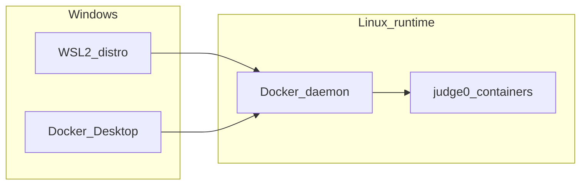

# Hướng dẫn thiết lập WSL để chạy Judge0 trên Windows

Tài liệu này mô tả cách bật **WSL2**, cài **Docker**, đặt mã nguồn và chạy **Judge0** (theo `docker-compose.yml` ở root repo `code-judge`) trên Windows.

---

## 1. Điều kiện trước

- Windows 10 (bản **2004** trở lên) hoặc Windows 11. Kiểm tra: **Win + R** → gõ `winver` → Enter.
- Quyền **Administrator** khi bật tính năng Windows / cài WSL lần đầu.
- RAM đủ cho Docker + vài container (khuyến nghị **8 GB** trở lên cho mượt).

---

## 2. Bật WSL2

### 2.1. Cách nhanh (khuyến nghị)

1. Mở **PowerShell** hoặc **Windows Terminal** → chuột phải → **Run as administrator**.
2. Chạy:

```powershell
wsl --install
```

3. **Khởi động lại** máy nếu Windows yêu cầu.
4. Sau khi reboot, mở **Ubuntu** (hoặc distro mặc định) từ Start Menu, đợi cài đặt xong, tạo **user / password** Linux (khi gõ password thường không hiện ký tự — bình thường).

### 2.2. Nếu `wsl --install` không dùng được — bật thủ công

**Giao diện:** **Win + R** → `optionalfeatures` → Enter. Tích:

- **Virtual Machine Platform** (bắt buộc cho WSL2)
- **Windows Subsystem for Linux**

**OK** → restart nếu được hỏi.

**Hoặc PowerShell (Admin):**

```powershell
dism.exe /online /enable-feature /featurename:Microsoft-Windows-Subsystem-Linux /all /norestart
dism.exe /online /enable-feature /featurename:VirtualMachinePlatform /all /norestart
```

Sau đó **Restart**.

### 2.3. Đặt WSL2 làm mặc định

Sau khi WSL đã cài (có thể không cần admin):

```powershell
wsl --set-default-version 2
```

Cài thêm distro (tuỳ chọn):

```powershell
wsl --list --online
wsl --install -d Ubuntu
```

### 2.4. Kiểm tra

```powershell
wsl --status
wsl --list --verbose
```

Cột **VERSION** của distro đang dùng phải là **2**.

---

## 3. Docker và WSL2

Judge0 chạy trong container Linux; bạn cần **Docker daemon** có thể chạy image Linux. Hai hướng phổ biến:

### Phương án A — Docker Desktop (dễ cho máy cá nhân)

1. Cài [Docker Desktop for Windows](https://docs.docker.com/desktop/install/windows-install/).
2. Mở Docker Desktop → **Settings** → **General**: bật **Use the WSL 2 based engine**.
3. **Settings** → **Resources** → **WSL integration**: bật tích cho distro bạn dùng (ví dụ **Ubuntu**).
4. Khởi động lại Docker Desktop nếu cần.

Sau đó trong terminal **bên trong WSL** (`wsl` hoặc app Ubuntu), lệnh `docker` và `docker compose` sẽ nói chuyện với Docker Desktop.

Kiểm tra trong WSL:

```bash
docker version
docker compose version
```

### Phương án B — Chỉ Docker trong WSL (không dùng Docker Desktop)

Cài Docker Engine theo hướng dẫn chính thức cho Ubuntu/Debian trong WSL (repository Docker hoặc `docker.io` tùy distro). Cần hiểu thêm về cgroup trên WSL nếu gặp lỗi hiếm. Phương án A thường ít rắc rối hơn trên Windows.

---

## 4. Chuẩn bị mã nguồn code-judge

**Khuyến nghị:** đặt repo trên **ổ đĩa Linux của WSL** (ví dụ `~/projects/code-judge`), **không** chỉ làm việc trên `C:\Users\...` mount sang `/mnt/c/...` khi chạy compose:

- Mount `/mnt/c` có thể **chậm** và đôi khi gây lỗi **permission** hoặc **line ending** với file được bind-mount vào container (ví dụ `scripts/isolate_stub.sh`).

Trong WSL:

```bash
mkdir -p ~/projects
cd ~/projects
git clone <URL-repo-code-judge> code-judge
cd code-judge
```

Nếu bạn vẫn dùng repo trên `C:\`, có thể thử được nhưng khi lỗi liên quan script/volume, hãy chuyển clone sang `~/...` trong WSL.

---

## 5. Chạy Judge0 bằng Docker Compose

Từ thư mục root repo (có file `docker-compose.yml`):

```bash
docker compose up -d
```

Các service liên quan Judge0 (theo compose hiện tại): `judge0-server`, `judge0-worker`, `db` (Postgres Judge0), `redis` (Redis Judge0), cùng volume stub `scripts/isolate_stub.sh`, `scripts/sudo_stub.sh`.

Đợi healthcheck xong (vài chục giây lần đầu kéo image). Xem log nếu cần:

```bash
docker compose logs -f judge0-server judge0-worker
```

**API Judge0** được publish ra máy host tại cổng **2358** (map `2358:2358`).

Kiểm tra nhanh từ Windows hoặc WSL:

```bash
curl -sS -o /dev/null -w "%{http_code}" http://localhost:2358/
```

(mã HTTP khác 000 thường là dấu hiệu service đã lên; tuỳ phiên bản có thể là 200, 302, 404 trên path gốc — quan trọng là có phản hồi.)

---

## 6. Kết nối worker / API với Judge0

Ứng dụng worker dùng biến môi trường (xem `apps/worker/.env.example`):

- `JUDGE0_URL=http://localhost:2358`

Khi chạy worker trên **Windows** (ngoài Docker) cùng lúc với compose trên localhost, URL này thường **đúng**. Nếu worker chạy **trong container** khác mạng, cần đổi hostname cho phù hợp (không nằm trong phạm vi tài liệu WSL cơ bản).

---

## 7. Tại sao cấu hình repo này phù hợp WSL?

Trong `docker-compose.yml`:

- `judge0-server` / `judge0-worker`: `privileged: true`, Postgres, Redis — stack Docker Linux thông thường; Docker Desktop + WSL2 thường hỗ trợ.
- `JUDGE0_USE_CGROUP=false` — giảm phụ thuộc cgroup so với Judge0 “đầy đủ” trên server.
- Volume ghi đè `scripts/isolate_stub.sh` lên `/usr/local/bin/isolate` — **không** dùng isolate kernel đầy đủ; stub dùng `bash`, `timeout`, `/tmp/isolate` trong container → yêu cầu host **thấp hơn** Judge0 production chuẩn.

**Kết luận:** WSL2 + Docker **đủ** để chạy Judge0 theo compose của repo này, miễn Docker chạy ổn.

---

## 8. Gỡ / tắt WSL (khi không cần)

### Chỉ xóa một distro (WSL vẫn còn)

```powershell
wsl --list --verbose
wsl --unregister Ubuntu
```

Thay `Ubuntu` bằng đúng tên trong `wsl -l -v`.

### Tắt hẳn tính năng trên Windows

**Win + R** → `optionalfeatures` → bỏ tích **Windows Subsystem for Linux** và (nếu chắc chắn không cần) **Virtual Machine Platform** → OK → **Restart**.

Lưu ý: tắt **Virtual Machine Platform** có thể ảnh hưởng thêm tới các tính năng khác dùng nền tảng ảo hóa nhẹ; chỉ tắt khi bạn hiểu hệ quả.

---

## 9. Xử lý sự cố nhanh

| Hiện tượng | Gợi ý |
|-------------|--------|
| `docker: command not found` trong WSL | Bật **WSL integration** trong Docker Desktop cho đúng distro, hoặc cài Docker trong WSL. |
| Container Judge0 restart liên tục | `docker compose logs judge0-server` — kiểm tra Postgres/Redis phụ thuộc; đảm bảo đủ RAM/disk. |
| Lỗi quyền / script khi mount từ `C:\` | Clone repo sang `~/projects/...` trong WSL; kiểm tra file `scripts/*.sh` dùng LF (Unix). |
| `privileged` / sandbox | Cập nhật Docker Desktop và WSL; xem log image `judge0/judge0`. |

---

## 10. Sơ đồ luồng (Docker Desktop + WSL2)



---

## 11. So sánh nhanh: PowerShell vs bash trong WSL

Docker Desktop dùng engine Linux (WSL2). Bạn có thể gọi `docker compose` từ **PowerShell** (thư mục Windows) hoặc từ **WSL** (thư mục `~` trong Linux). Cả hai đều có thể chạy được stack; **khuyến nghị** chạy compose từ WSL với mã nguồn nằm trên filesystem Linux để tránh vấn đề mount `/mnt/c`.


## NOTICE: change run type of script file isolate_stub.sh and sudo_stub.sh from CSRF to LF